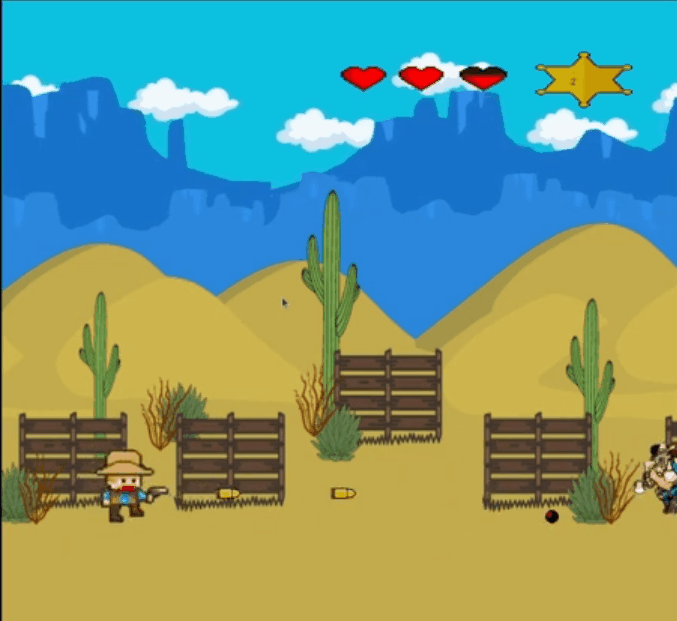

# Wild West Showdown

A 3D OpenGL C++ project simulating a Western-themed game environment with characters, enemies, and a main menu. This project utilizes OpenGL with libraries such as GLEW, GLUT, GLFW, and SOIL for rendering and texture management.

### 📽️ Preview



## 🛠 Dependencies

Make sure you are using a Debian-based Linux distribution (like Ubuntu). Install the required development libraries using:

```bash
sudo apt update
sudo apt install libglew-dev libglfw3-dev freeglut3-dev libsoil-dev libglm-dev
```


## 📁 Project Structure

- `Main.cpp`: Entry point of the application.
- `*.hpp` / `*.cpp`: Game logic, characters, collisions, rendering, etc.
- `Makefile`: Used to build and run the project.
- `Texturas/`, `Models/`, etc.: Resources like textures, models, and fonts (if applicable).

## ⚙️ Build & Run

You can build and run the project using `make`:

```bash
make executar
```

This will:

1. Compile all `.cpp` files.
2. Link the final executable to required libraries.
3. Run the game.
4. Clean up the build files (`.o` and executable).

To manually clean the build files without running:

```bash
make limpar
```

## 🧩 Linked Libraries

- `-lGL`: OpenGL
- `-lGLU`: OpenGL Utility Library
- `-lglut`: GLUT (window & input)
- `-lglfw`: GLFW (alternative for window/input)
- `-lGLEW`: OpenGL Extension Wrangler
- `-lSOIL`: Image loading for textures
- `-lm`: Math library
- `-std=c++11`: C++11 standard

> ⚠️ Note: Do **not mix** GLFW and GLUT in the same rendering context unless the architecture is explicitly designed to support both.

## 🎮 Game Features (Examples)

- 3D environment with player and enemies.
- Collision detection.
- Menu interface.
- Dynamic object rendering.
- Texture management via SOIL.

## 👤 Authors

For more information, see the `readme.txt` file inside the `/Wild West Showdown/` directory (written in Portuguese).

```

